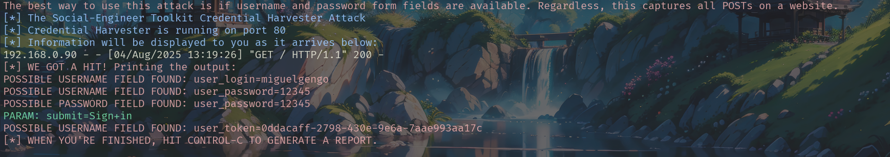

# 🛡️ Simulação de Phishing Educacional com Social-Engineer Toolkit (SET)

> Projeto profissional de **educação em cibersegurança** com uso do Social-Engineer Toolkit (SET) para simulação controlada de ataques de coleta de credenciais, ideal para aprendizado prático em ambientes laboratoriais e de testes.

---

## 🧠 Visão Geral

Este projeto tem como objetivo **demonstrar na prática** como ataques de phishing baseados em engenharia social funcionam, **em um ambiente isolado e seguro**. Utilizando o poderoso *Social-Engineer Toolkit (SET)*, clonamos uma página de login legítima e capturamos as credenciais fornecidas durante o teste — simulando o comportamento de um atacante ético.

O uso foi exclusivo para fins **educacionais**, **laboratoriais** e **sem qualquer dano ou invasão a sistemas reais**.

---

## 🧰 Ferramentas Utilizadas

- **Sistema Operacional**: Kali Linux
- **Toolkit**: [SET - Social-Engineer Toolkit](https://github.com/trustedsec/social-engineer-toolkit)
- **Editor**: Terminal interativo
- **Browser usado para simulação**: MicrosoftEde
- **Servidor de captura**: Porta 80 HTTP padrão
- **Rede local (NAT)** com IP interno `192.168.0.90`

---

## 📌 Etapas Realizadas no Projeto

```
         .M"""bgd `7MM"""YMM MMP""MM""YMM
        ,MI    "Y   MM    `7 P'   MM   `7
        `MMb.       MM   d        MM
          `YMMNq.   MMmmMM        MM
        .     `MM   MM   Y  ,     MM
        Mb     dM   MM     ,M     MM
        P"Ybmmd"  .JMMmmmmMMM   .JMML.
```

### 1. Início do SET
- Comando: `sudo setoolkit`
- Versão: `8.0.3 - Maverick`
- Seleção: `2) Website Attack Vectors`

### 2. Seleção do Vetor de Ataque Web
- Opção escolhida: `3) Credential Harvester Attack Method`

### 3. Escolha da Técnica
- Técnica selecionada: `2) Site Cloner`
- IP do atacante (callback): `192.168.0.90`
- Site clonado: `http://zero.webappsecurity.com/login.html`

### 4. Execução do Ataque Simulado
- Clonagem da página de login com campos de `username` e `password`
- Acesso ao IP pelo navegador para simular a vítima
- Entrada de dados falsos: login `miguelgengo`, senha `12345`

---

## 🖥️ Resultado Capturado (comprovação visual)

> Abaixo, a imagem obtida diretamente da execução da ferramenta após um "hit":




---

## 🧾 Dados Extraídos na Simulação

```
[*] WE GOT A HIT! Printing the output:
POSSIBLE USERNAME FIELD FOUND: user_login=miguelgengo
POSSIBLE USERNAME FIELD FOUND: user_password=12345
POSSIBLE PASSWORD FIELD FOUND: user_password=12345
PARAM: submit=Sign+in
POSSIBLE USERNAME FIELD FOUND: user_token=0ddacaff-2798-430e-9e6a-7aae993aa17c
```

---

## 🎯 Objetivos Didáticos Alcançados

- ✅ Entendimento prático de como um ataque de phishing é realizado
- ✅ Aprendizado sobre captura de credenciais via HTTP POST
- ✅ Análise de código HTML clonado e identificação de campos
- ✅ Interpretação de logs de coleta
- ✅ Simulação de rede local para fins de cibersegurança ofensiva (ética)

---

## 📘 Considerações Finais

Este projeto **não visa violar a privacidade, segurança ou ética profissional**, e sim **fortalecer o conhecimento sobre as ameaças reais enfrentadas em ambientes web modernos**. A experiência prática, aliada ao estudo das técnicas de *engenharia social*, prepara melhor estudantes e profissionais para a **defesa digital**.

> “Para proteger, é preciso primeiro entender.”

---

## 📎 Referências

- https://github.com/trustedsec/social-engineer-toolkit
- https://www.trustedsec.com
- https://owasp.org/www-project-top-ten/
- https://zero.webappsecurity.com/

---

🔐 **Autor:** Miguel Gengo  
🔗 [LinkedIn](https://www.linkedin.com/in/miguel-gengo-8157b72a1)

---
